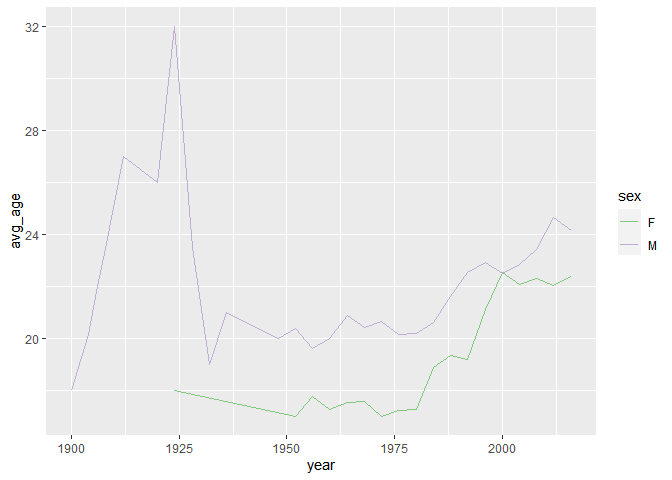

    ## Warning: package 'ggplot2' was built under R version 4.2.2

    ## Warning: package 'tidyverse' was built under R version 4.2.2

    ## ── Attaching packages ─────────────────────────────────────── tidyverse 1.3.2 ──
    ## ✔ tibble  3.1.8      ✔ dplyr   1.0.10
    ## ✔ tidyr   1.2.1      ✔ stringr 1.5.0 
    ## ✔ readr   2.1.3      ✔ forcats 0.5.2 
    ## ✔ purrr   1.0.1

    ## Warning: package 'tibble' was built under R version 4.2.2

    ## Warning: package 'tidyr' was built under R version 4.2.2

    ## Warning: package 'readr' was built under R version 4.2.2

    ## Warning: package 'purrr' was built under R version 4.2.2

    ## Warning: package 'dplyr' was built under R version 4.2.2

    ## Warning: package 'stringr' was built under R version 4.2.2

    ## Warning: package 'forcats' was built under R version 4.2.2

    ## ── Conflicts ────────────────────────────────────────── tidyverse_conflicts() ──
    ## ✖ dplyr::filter() masks stats::filter()
    ## ✖ dplyr::lag()    masks stats::lag()

    ## Warning: package 'rsample' was built under R version 4.2.2

    ## Warning: package 'caret' was built under R version 4.2.2

    ## Loading required package: lattice
    ## 
    ## Attaching package: 'caret'
    ## 
    ## The following object is masked from 'package:purrr':
    ## 
    ##     lift

    ## Warning: package 'modelr' was built under R version 4.2.2

    ## Warning: package 'foreach' was built under R version 4.2.2

    ## 
    ## Attaching package: 'foreach'
    ## 
    ## The following objects are masked from 'package:purrr':
    ## 
    ##     accumulate, when

1.  One interesting observation from the 2008 flight data for
    Austin-Bergstrom International Airport is the departure time of
    flights over the course of the week.

<!-- -->

    ggplot(ABIA)+
      geom_boxplot(aes(group=DayOfWeek, x=DayOfWeek, y=DepTime))+
      xlim(0,7.5)

    ## Warning: Removed 1413 rows containing non-finite values (`stat_boxplot()`).

The boxplots show the Departure Time of the flights across the week,
where 1~7 represent the days Monday through Sunday. From the boxplots
above, we see that the mean departure time is roughly the same for all
the flights except on Saturdays, where the flight departs early. With
such a large sample size of almost 100,000 flights, we would expect an
even spread across the week, but Saturday’s departure time is a clear
outlier. However, I came up with a potential explanation for this
phenomenon from the graph below.

    library(ggplot2)
    ggplot(ABIA)+
      geom_boxplot(aes(group=DayOfWeek, x=DayOfWeek, y=Distance))+
      xlim(0,7.5)

By graphing the distance that flights have to travel across the week, we
can see that flights on Saturday have a higher mean distance. So flights
would be flying a longer distance than normal on average, which would
explain why the flights must depart earlier in order to travel a longer
distance and arrive on time.

1.  

<!-- -->

     olympics <- read.csv("https://raw.githubusercontent.com/jgscott/ECO395M/master/data/olympics_top20.csv")

1.  

<!-- -->

    olympics %>%
      group_by(sex) %>%
      select(height, sport, event) %>%
      summarize(q95_heights = quantile(height, 0.95))

    ## Adding missing grouping variables: `sex`

    ## # A tibble: 2 × 2
    ##   sex   q95_heights
    ##   <chr>       <dbl>
    ## 1 F             186
    ## 2 M             198

The 95th percentile of heights for female competitors is 186cm.

1.  

<!-- -->

    data_olympics =olympics %>%
      filter(sex == "F") %>%
      group_by(event) %>%
      summarize(sdh = sd(height))

    head(arrange(data_olympics, desc(sdh)))

    ## # A tibble: 6 × 2
    ##   event                                   sdh
    ##   <chr>                                 <dbl>
    ## 1 Rowing Women's Coxed Fours            10.9 
    ## 2 Basketball Women's Basketball          9.70
    ## 3 Rowing Women's Coxed Quadruple Sculls  9.25
    ## 4 Rowing Women's Coxed Eights            8.74
    ## 5 Swimming Women's 100 metres Butterfly  8.13
    ## 6 Volleyball Women's Volleyball          8.10

The event Rowing Women’s Coxed Fours had the greatest standard deviation
in female competitor’s heights.

1.  

<!-- -->

     olympics <- read.csv("https://raw.githubusercontent.com/jgscott/ECO395M/master/data/olympics_top20.csv")

     olympics_swim = olympics %>%
      group_by(year, sex) %>%
      filter(sport == "Swimming") %>%
      summarize(avg_age = mean(age))

    ## `summarise()` has grouped output by 'year'. You can override using the
    ## `.groups` argument.

     ggplot(olympics_swim)+
      geom_line(aes(x=year, y=avg_age, color=sex))+
      scale_color_brewer(type = "qual")

 From the 1930s to
now, the average age of Olympic Swimmers has increased over time for
both males and females. However, there were only male Olympic Swimmers
in 1900 to 1925, where the trend was increasing over time until a sharp
drop in the average age around 1925.

1.  

<!-- -->

    sclass <- read.csv("https://raw.githubusercontent.com/jgscott/ECO395M/master/data/sclass.csv")

    sclass350 = sclass %>%
      filter(trim == 350)

    sclass65AMG = sclass %>%
      filter(trim == "65 AMG")

After filtering the two trim levels, I ran KNN for the 350 trim level
below:

    sclass350_split = initial_split(sclass350, prop=0.8)
    sclass350_train = training(sclass350_split)
    sclass350_test = testing(sclass350_split)

    K_folds =5
    sclass350_folds = crossv_kfold(sclass350, k=K_folds)

    cv_grid350 = foreach(k=2:100, .combine = "rbind") %dopar% {
      models350= map(sclass350_folds$train, ~knnreg(mileage ~ price, k=k, data= ., use.all=FALSE))
      errs350= map2_dbl(models350, sclass350_folds$test, modelr::rmse)
      c(k=k, err=mean(errs350), std_err= sd(errs350)/sqrt(K_folds))
    } %>% as.data.frame

    ## Warning: executing %dopar% sequentially: no parallel backend registered

    head(cv_grid350, n=20)  

    ##            k      err  std_err
    ## result.1   2 15637.83 685.2325
    ## result.2   3 14804.48 475.4673
    ## result.3   4 14153.25 305.2235
    ## result.4   5 13859.89 158.0577
    ## result.5   6 13531.85 193.2493
    ## result.6   7 13430.07 173.0676
    ## result.7   8 13368.26 193.8678
    ## result.8   9 13228.32 271.6378
    ## result.9  10 13279.34 273.2828
    ## result.10 11 13303.43 309.4262
    ## result.11 12 13237.54 275.4928
    ## result.12 13 13203.08 318.4462
    ## result.13 14 13240.15 350.0428
    ## result.14 15 13321.28 339.5621
    ## result.15 16 13428.45 359.7054
    ## result.16 17 13420.05 396.5919
    ## result.17 18 13391.60 367.1959
    ## result.18 19 13484.08 385.1546
    ## result.19 20 13555.13 402.8482
    ## result.20 21 13569.06 400.3812

    ggplot(cv_grid350)+
      geom_point(aes(x=k, y=err))

We can see that the lowest rmse is at K=13 for the 350 trim level. The
fitted model is below:

    knn13 = knnreg(mileage ~ price, data=sclass350_train, k=13)
    modelr::rmse(knn13, sclass350_test)

    ## [1] 12567.52

    sclass350_test = sclass350_test %>%
      mutate(mileage_pred = predict(knn13, sclass350_test))

    p_test = ggplot(data=sclass350_test)+
      geom_point(aes(x=price, y=mileage), alpha=0.2)

    p_test + geom_line(aes(x=price, y=mileage_pred), color="red", linewidth=1.5)

Next, I ran the 65 AMG trim level:

    sclass65AMG_split = initial_split(sclass65AMG, prop=0.8)
    sclass65AMG_train = training(sclass65AMG_split)
    sclass65AMG_test = testing(sclass65AMG_split)

    K_folds =5
    sclass65AMG_folds = crossv_kfold(sclass65AMG, k=K_folds)

    cv_grid65AMG = foreach(k=2:100, .combine = "rbind") %dopar% {
      models65AMG= map(sclass65AMG_folds$train, ~knnreg(mileage ~ price, k=k, data= ., use.all=FALSE))
      errs65AMG= map2_dbl(models65AMG, sclass65AMG_folds$test, modelr::rmse)
      c(k=k, err=mean(errs65AMG), std_err= sd(errs65AMG)/sqrt(K_folds))
    } %>% as.data.frame

    head(cv_grid65AMG, n=20)  

    ##            k      err  std_err
    ## result.1   2 19752.57 1361.362
    ## result.2   3 18516.08 1656.986
    ## result.3   4 17938.67 1676.751
    ## result.4   5 17886.82 1588.706
    ## result.5   6 17774.37 1678.550
    ## result.6   7 17577.87 1480.107
    ## result.7   8 17246.73 1443.913
    ## result.8   9 16627.87 1455.526
    ## result.9  10 16566.01 1481.459
    ## result.10 11 16475.59 1485.737
    ## result.11 12 16428.72 1492.329
    ## result.12 13 16414.05 1522.756
    ## result.13 14 16256.12 1602.676
    ## result.14 15 16179.85 1498.507
    ## result.15 16 16139.90 1513.243
    ## result.16 17 16161.31 1477.744
    ## result.17 18 16208.20 1498.109
    ## result.18 19 16243.76 1497.998
    ## result.19 20 16241.98 1418.294
    ## result.20 21 16152.26 1399.181

    ggplot(cv_grid65AMG)+
      geom_point(aes(x=k, y=err))

We can see that the lowest rmse is at K=18 for the 65AMG trim level. The
fitted model is below:

    knn18 = knnreg(mileage ~ price, data=sclass65AMG_train, k=18)
    modelr::rmse(knn18, sclass65AMG_test)

    ## [1] 15054.46

    sclass65AMG_test = sclass65AMG_test %>%
      mutate(mileage_pred = predict(knn18, sclass65AMG_test))

    p_test2 = ggplot(data=sclass65AMG_test)+
      geom_point(aes(x=price, y=mileage), alpha=0.2)

    p_test2 + geom_line(aes(x=price, y=mileage_pred), color="red", linewidth=1.5)

